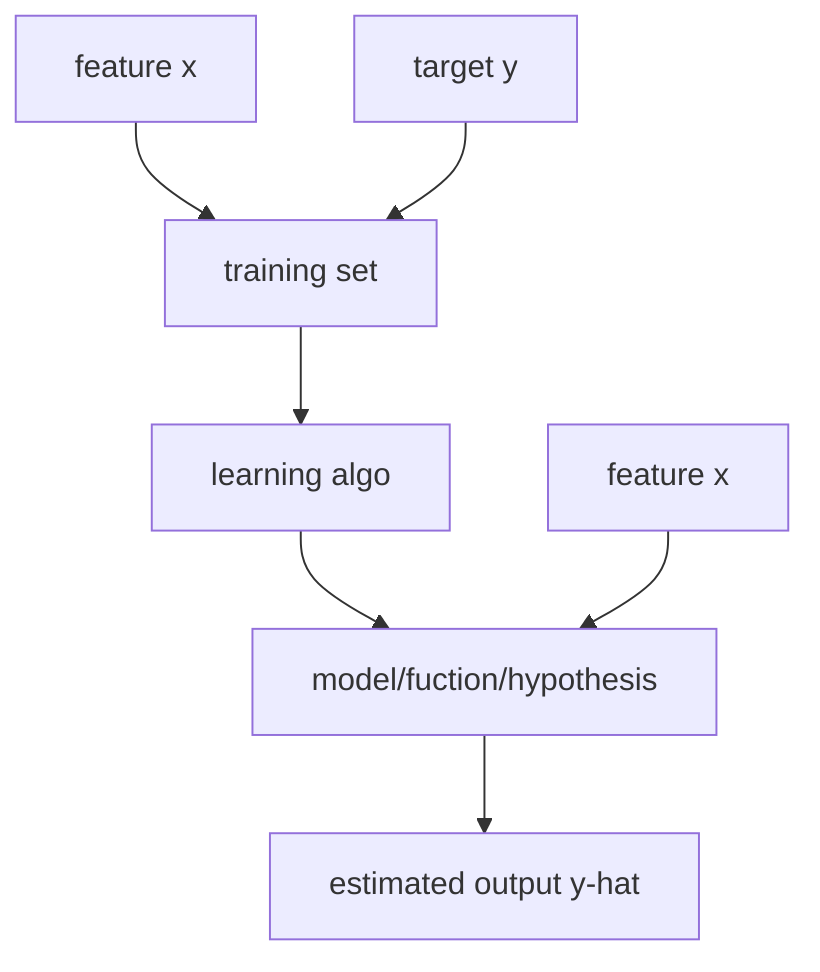

# regression

## linear regression

Predicts infinite, continuous numbers (regression model).

Is "supervised" because the model is trained on labeled data.

## classification model

Predicts finite, discrete categories.

## terminology

term | definition
--- | ---
training set | data used to train the model
`x` | feature, input variable
`y` | output/target variable
`m` | number of training examples
`(x,y)` | one training example
`(x^(i),y^(i))` | `i`th training example
univariate | function with one variable only

---

### How to represent model `f`?

`f(sub w),(sub b) = wx + b`
`f = wx + b`
`f(x)`
